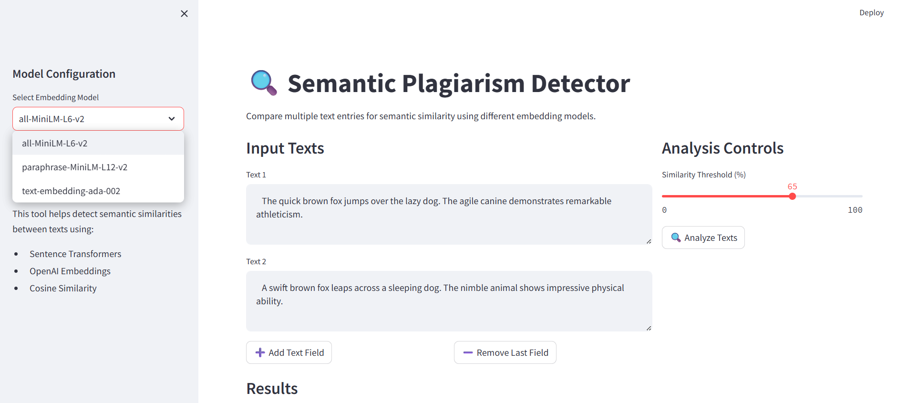
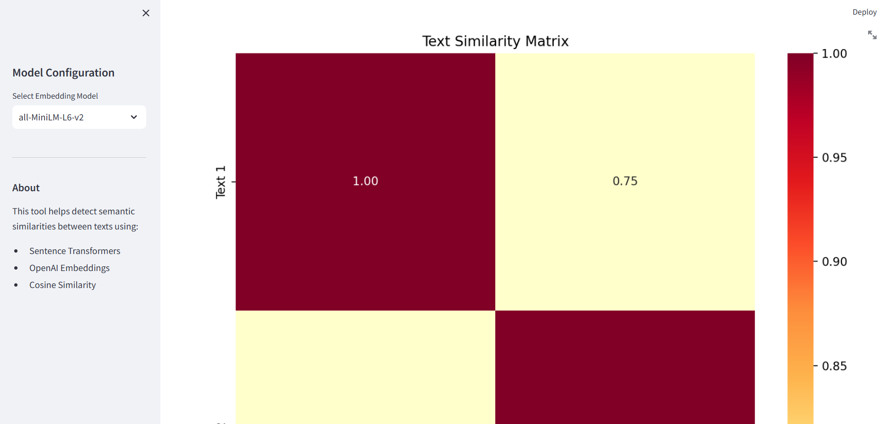
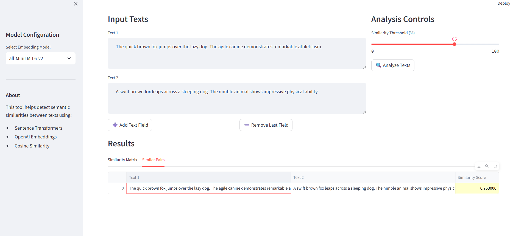
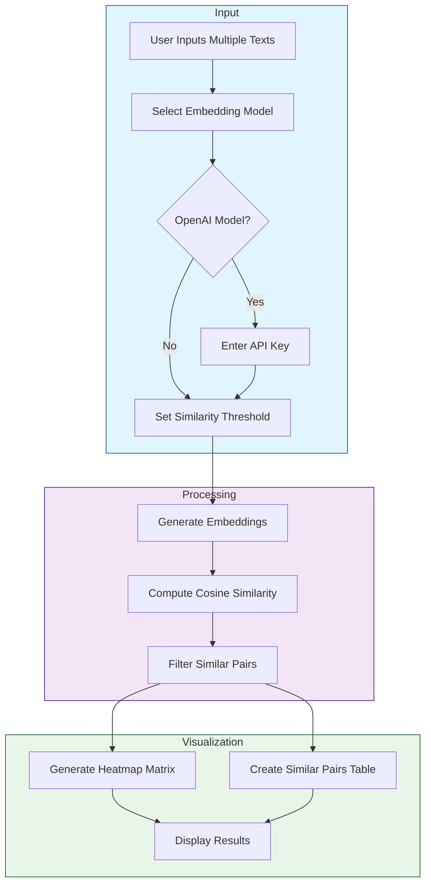

# 🔍 Semantic Plagiarism Detector

A powerful Streamlit web application that uses state-of-the-art embedding models to detect semantic similarities between multiple text entries. Unlike traditional plagiarism checkers that look for exact matches, this tool can identify similar meanings even when expressed with different words.

## 📸 Application Screenshots


## ✨ Features

- **Multiple Text Analysis**: Dynamically add and compare multiple text entries
- **Advanced Embedding Models**:
  - `sentence-transformers: all-MiniLM-L6-v2` (Fast and efficient)
  - `sentence-transformers: paraphrase-MiniLM-L12-v2` (Better accuracy)
  - `OpenAI embeddings (text-embedding-ada-002)` (State-of-the-art)
- **Real-time Processing**: In-memory computation with no data persistence
- **Interactive Visualizations**:
  - Similarity matrix heatmap
  - Detailed similarity pairs table
  - Configurable similarity threshold
- **User-friendly Interface**:
  - Intuitive text input management
  - Model selection dropdown
  - Adjustable similarity threshold slider

## 🚀 Quick Start

### Prerequisites

- Python 3.8 or higher
- pip (Python package installer)
- OpenAI API key (optional - only for OpenAI embeddings)

### Installation

1. **Clone the repository**
```bash
git clone <repository-url>
cd semantic-plagiarism-detector
```

2. **Create and activate virtual environment**
```bash
# Windows
python -m venv venv
venv\Scripts\activate

# Linux/MacOS
python -m venv venv
source venv/bin/activate
```

3. **Install dependencies**
```bash
pip install -r requirements.txt
```

4. **Set up OpenAI API key (Optional)**
- Create a `.env` file in the project root
- Add your OpenAI API key:
```
OPENAI_API_KEY=your-api-key-here
```

### Running the Application

```bash
python -m streamlit run app.py
```
The application will open in your default web browser at `http://localhost:8501`.

## 💡 Usage Guide

1. **Adding Text**
   - Start with one text box
   - Click "➕ Add Text Field" for more entries
   - Use "➖ Remove Last Field" to remove entries
   
   
   *The interface allows you to dynamically add or remove text fields for comparison.*


2. **Selecting Embedding Model**
   - Choose a model from the sidebar
   - For OpenAI model, enter API key when prompted

3. **Setting Threshold**
   - Use the slider to set similarity threshold
   - Default is 80%
   - Adjust based on your needs

4. **Analyzing Texts**
   - Click "🔍 Analyze Texts"
   - View results in two tabs:
     
     **Similarity Matrix View:**
     
     *The similarity matrix visualizes pairwise comparisons between all texts.*
     
     **Similar Pairs View:**
     
     *Table shows text pairs that exceed the similarity threshold, sorted by similarity score.*

### Understanding the Similarity Matrix (Heatmap)

<!--  -->
*The similarity matrix visualizes pairwise comparisons between all texts.*

#### How to Read the Heatmap:

1. **Matrix Structure**
   - Each cell represents the similarity between two texts
   - Rows and columns are labeled as "Text 1", "Text 2", etc.
   - The diagonal (top-left to bottom-right) always shows 100% similarity (text compared to itself)

2. **Color Interpretation**
   - Darker/warmer colors indicate higher similarity
   - Lighter/cooler colors indicate lower similarity
   - The color scale ranges from 0% (completely different) to 100% (identical)

3. **Reading Examples**
   - To find similarity between Text 1 and Text 2:
     1. Find Text 1 on one axis and Text 2 on the other
     2. Look at the intersection cell
     3. The number in the cell is the similarity percentage
   - The matrix is symmetric: similarity(Text1, Text2) = similarity(Text2, Text1)

4. **Practical Tips**
   - Focus on cells with darker colors for potential matches
   - Values above 80% typically indicate significant semantic similarity
   - Compare the similarity scores with the actual text content to understand the context

5. **Common Patterns**
   - High similarity (>80%): Likely semantic duplicates or paraphrases
   - Medium similarity (50-80%): Related content but different context
   - Low similarity (<50%): Likely unrelated content

## 📁 Project Structure

```
semantic-plagiarism-detector/
├── app.py                 # Main Streamlit application
├── embeddings.py          # Embedding model handlers
├── similarity.py          # Similarity computation
├── visualization.py       # Visualization functions
├── requirements.txt       # Project dependencies
├── .env                   # Environment variables (optional)
├── assets/               # Screenshots and images
│   ├── main-interface.png
│   ├── results-matrix.png
│   └── results-pairs.png
└── README.md             # Documentation
```

## 🔧 Technical Details

### Execution Flow

The following diagram illustrates the application's execution flow from user input to result visualization:



The flow is divided into three main phases:
1. **Input Phase**: User provides texts and configures the analysis settings
2. **Processing Phase**: System generates embeddings and computes similarities
3. **Visualization Phase**: Results are transformed into visual representations

### Embedding Models

1. **all-MiniLM-L6-v2**
   - Lightweight and fast
   - 384-dimensional embeddings
   - Good for general-purpose use

2. **paraphrase-MiniLM-L12-v2**
   - More accurate than L6
   - 384-dimensional embeddings
   - Better for paraphrase detection

3. **text-embedding-ada-002**
   - OpenAI's advanced model
   - 1536-dimensional embeddings
   - Best accuracy but requires API key

### Similarity Computation

- Uses cosine similarity metric
- Implemented via scikit-learn
- Optimized for in-memory processing
- Results normalized to percentage scale

## 📊 Example Use Cases

1. **Academic Integrity**
   - Compare student submissions
   - Check against reference texts
   - Identify paraphrased content

2. **Content Analysis**
   - Compare article versions
   - Check for duplicate content
   - Analyze text similarity

3. **Research**
   - Compare research abstracts
   - Identify similar papers
   - Analyze methodology descriptions

## ⚠️ Limitations

- Processing time increases with text length
- OpenAI API has rate limits and costs
- Large number of texts may impact performance
- Results are probabilistic, not deterministic

## 🤝 Contributing

Contributions are welcome! Please feel free to submit a Pull Request.

1. Fork the repository
2. Create your feature branch (`git checkout -b feature/AmazingFeature`)
3. Commit your changes (`git commit -m 'Add some AmazingFeature'`)
4. Push to the branch (`git push origin feature/AmazingFeature`)
5. Open a Pull Request

## 📝 License

This project is licensed under the MIT License - see the LICENSE file for details.

## 🙏 Acknowledgments

- Sentence Transformers by SBERT
- OpenAI for embeddings API
- Streamlit for the web framework
- scikit-learn for similarity computations 