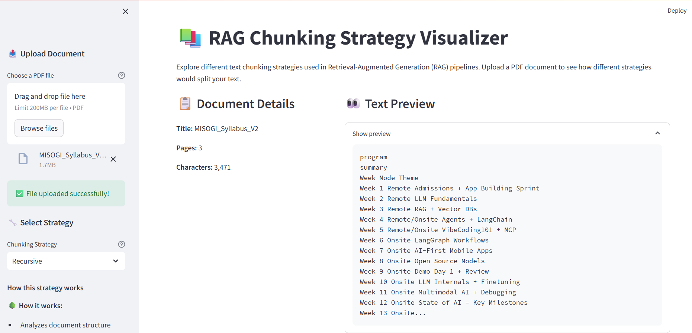
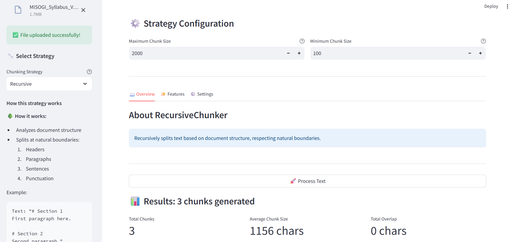

# 📚 RAG Chunking Strategy Visualizer

A powerful tool for visualizing and understanding different text chunking strategies used in Retrieval-Augmented Generation (RAG) pipelines. This application helps developers and researchers explore how different chunking methods affect text segmentation in RAG systems.

## 🌟 Appliaction UI




## 🌟 Features

- 📤 Upload and process PDF documents
- 🔄 Multiple chunking strategies visualization
- 📊 Interactive results display
- 💾 Export results in JSON/CSV formats
- 📱 Responsive and user-friendly interface
- 🎨 Beautiful visualization of chunk boundaries
- 📝 Detailed metadata for each chunk

## 🚀 Getting Started

### Prerequisites

- Python 3.8 or higher
- pip (Python package installer)

### Installation

1. Clone the repository:
```bash
git clone https://github.com/yourusername/rag-chunking-visualizer.git
cd rag-chunking-visualizer
```

2. Create and activate a virtual environment:
```bash
# Windows
python -m venv venv
.\venv\Scripts\activate

# Linux/MacOS
python3 -m venv venv
source venv/bin/activate
```

3. Install dependencies:
```bash
pip install -r requirements.txt
```

### Running the Application

1. Start the Streamlit server:
```bash
streamlit run app.py
```

2. Open your browser and navigate to:
```
http://localhost:8501
```

## 📊 Chunking Strategies

### 1. Fixed-Size Chunking

*Screenshot will be added once uploaded to the assets folder*

- **Description**: Splits text into chunks of a fixed number of tokens/characters
- **Best for**: Documents with uniform content distribution
- **Parameters**:
  - Chunk size (tokens/characters)
  - Overlap size (optional)
- **Example**:
```python
text = "This is a sample text for chunking demonstration."
chunk_size = 10
# Result: ["This is a ", "sample tex", "t for chun", "king demon", "stration."]
```

### 2. Sliding Window Chunking

*Screenshot will be added once uploaded to the assets folder*

- **Description**: Creates overlapping chunks by sliding a window over the text
- **Best for**: Maintaining context between chunks
- **Parameters**:
  - Window size
  - Stride length
- **Example**:
```python
text = "This is a sample text."
window_size = 10
stride = 5
# Result: ["This is a ", "is a samp", "a sample ", "sample tex", "ple text."]
```

### 3. Sentence-Based Chunking

*Screenshot will be added once uploaded to the assets folder*

- **Description**: Splits text at sentence boundaries
- **Best for**: Preserving semantic units
- **Parameters**:
  - Max sentences per chunk
  - Min/max chunk size
- **Example**:
```python
text = "This is sentence one. This is sentence two. This is three."
max_sentences = 2
# Result: ["This is sentence one. This is sentence two.", "This is three."]
```

### 4. Recursive Chunking

*Screenshot will be added once uploaded to the assets folder*

- **Description**: Recursively splits text based on multiple criteria
- **Best for**: Complex documents with hierarchical structure
- **Parameters**:
  - Primary split criteria
  - Secondary split criteria
  - Max chunk size
- **Example**:
```python
text = "Chapter 1\nSection A\nContent here.\nSection B\nMore content."
# First splits by Chapter, then by Section, then by size if needed
```

## 📊 Visualization Features

- Chunk boundary highlighting
- Metadata display (tokens, characters, etc.)
- Overlap visualization
- Statistical analysis
- Export capabilities


*Screenshot will be added once uploaded to the assets folder*

## 🛠️ Configuration

The application supports various configuration options:

```python
# config.py example
CHUNK_SIZES = {
    'small': 100,
    'medium': 250,
    'large': 500
}

OVERLAP_SIZES = {
    'none': 0,
    'small': 20,
    'medium': 50
}
```

## 🤝 Contributing

Contributions are welcome! Please feel free to submit a Pull Request. For major changes, please open an issue first to discuss what you would like to change.

1. Fork the repository
2. Create your feature branch (`git checkout -b feature/AmazingFeature`)
3. Commit your changes (`git commit -m 'Add some AmazingFeature'`)
4. Push to the branch (`git push origin feature/AmazingFeature`)
5. Open a Pull Request

## 📝 License

This project is licensed under the MIT License - see the [LICENSE](LICENSE) file for details.

## 🙏 Acknowledgments

- Streamlit team for the amazing framework
- RAG community for inspiration
- Contributors and users of the tool

## 📞 Contact

Your Name - [@yourtwitter](https://twitter.com/yourtwitter)

Project Link: [https://github.com/yourusername/rag-chunking-visualizer](https://github.com/yourusername/rag-chunking-visualizer)

---
*Note: Replace placeholder image paths and links with actual content once screenshots are added to the assets folder.* 